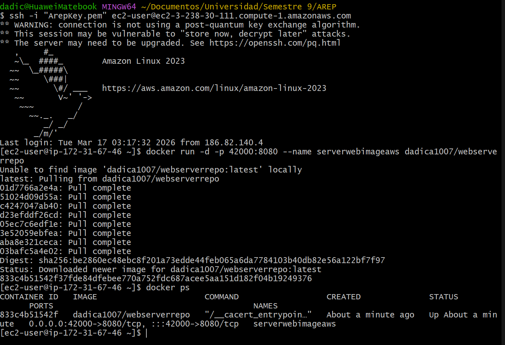
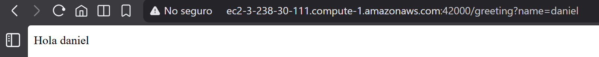

# Mini Web Framework en Java

Framework HTTP simple en Java para:

- Definir servicios REST `GET` con lambdas.
- Construir aplicaciones web a partir de POJOs anotados con `@RestController`.
- Extraer query parameters con `HttpRequest`.
- Servir archivos estáticos desde `target/classes`.

## Arquitectura

- `com.adojos.app.http`: servidor HTTP, request/response, archivos estáticos y handlers.
- `com.adojos.app.context`: contenedor ligero por anotaciones y descubrimiento en classpath.
- `com.adojos.app.annotations`: anotaciones del microframework.
- `com.adojos.app.controllers`: controladores POJO descubiertos automáticamente.
- `com.adojos.app`: puntos de entrada del framework (`App`, `ManualRoutesApp`, `CommandLineApp`).
- `com.adojos.app.examples`: utilidades de red/socket de apoyo.

## Características implementadas

1. `HttpServer.get(path, (req, res) -> ...)` para endpoints manuales
2. Descubrimiento automático de clases anotadas con `@RestController`
3. Ejecucion por linea de comandos de un controlador y una ruta especifica
4. Soporte para `@GetMapping("/ruta")` con retorno `String`
5. Soporte para `@RequestParam(value = "name", defaultValue = "World")`
6. Servidor concurrente con pool fijo de workers para atender multiples clientes al mismo tiempo
7. `HttpServer.staticfiles("webroot/public")` (también soporta `"/webroot/public"`)
8. Servidor en `http://localhost:8080`
9. Entrega de archivos estáticos cuando no hay endpoint dinámico

## Sistema de anotaciones

El framework usa anotaciones propias para convertir POJOs en controladores REST sin necesidad de configuracion XML ni herencia de clases base.

### `@RestController`

Marca una clase como controlador descubrible por el framework. El contenedor (`AnnotationApplicationContext`) escanea el classpath buscando clases con esta anotacion y las registra automaticamente.

```java
@RestController
public class HelloController {
    // metodos anotados con @GetMapping
}
```

Sin esta anotacion, la clase es ignorada en el modo de descubrimiento automatico (`App`). En `CommandLineApp` puede cargarse explicitamente aunque la lleve.

### `@GetMapping`

Asocia un metodo de un controlador a una ruta HTTP `GET`. El valor del atributo `value` es la ruta que debe coincidir con la URL de la solicitud entrante.

```java
@GetMapping("/pi")
public String pi() {
    return String.valueOf(Math.PI);
}
```

El metodo debe retornar `String`. El framework extrae el valor de retorno y lo escribe directamente en el cuerpo de la respuesta HTTP.

### `@RequestParam`

Extrae un query parameter de la URL y lo inyecta como argumento del metodo. Soporta un valor por defecto si el parametro no esta presente en la URL.

```java
@GetMapping("/greeting")
public String greeting(@RequestParam(value = "name", defaultValue = "World") String name) {
    return "Hola " + name;
}
```

- `value`: nombre del parametro en la URL (`?name=Ana`).
- `defaultValue`: valor usado si el parametro no aparece en la URL.

Si se llama `GET /greeting?name=Daniel`, el metodo recibe `"Daniel"`. Si se llama `GET /greeting`, recibe `"World"`.

### Flujo de procesamiento de una solicitud anotada

```
Solicitud HTTP GET /greeting?name=Ana
        │
        ▼
HttpServer  →  extrae ruta "/greeting"
        │
        ▼
ENDPOINTS.get("/greeting")  →  WebMethod (wrapper del metodo anotado)
        │
        ▼
WebMethod.execute(HttpRequest, HttpResponse)
        │
        ▼
Refleccion: extrae @RequestParam de la firma, consulta HttpRequest.getValues("name")
        │
        ▼
Invoca HelloController.greeting("Ana")  →  retorna "Hola Ana"
        │
        ▼
HttpResponse escribe "Hola Ana" en el socket
```

### Como registrar un controlador nuevo

1. Crear una clase en `com.adojos.app.controllers` (o cualquier subpaquete).
2. Anotarla con `@RestController`.
3. Agregar metodos con `@GetMapping("/ruta")`.
4. Agregar `@RequestParam` a los parametros que se lean de la URL.
5. Compilar y ejecutar `App`: el controlador se descubre automaticamente.

No hay que registrar la clase en ningun archivo de configuracion.

## Modelo de concurrencia

El servidor usa un modelo `acceptor + worker pool`:

1. El hilo principal queda bloqueado en `ServerSocket.accept()`.
2. Cada conexion entrante se delega a un worker del pool (`ExecutorService`).
3. Cada worker procesa la peticion completa y responde de forma independiente.

Implementacion actual en `HttpServer`:

- Pool fijo: `Math.max(4, Runtime.getRuntime().availableProcessors() * 2)`.
- Mapa de endpoints thread-safe con `ConcurrentHashMap`.
- Carga de rutas anotadas protegida con `ROUTE_LOADING_LOCK` para evitar carreras.
- Workers con nombres `http-worker-N` para facilitar depuracion.
- Apagado elegante con `stop()` y `shutdown hook` (`http-shutdown-hook`).

Esto permite atender multiples clientes en paralelo sin bloquear toda la aplicacion por una sola conexion lenta.

### Consideraciones de seguridad en concurrencia

- El registro de rutas usa `putIfAbsent` para evitar sobreescrituras por carreras.
- `StaticFileHandler` mantiene la carpeta estatica en un campo `volatile` para visibilidad entre hilos.
- El contexto de cada request (`HttpRequest` y `HttpResponse`) se crea por conexion, sin compartirse entre threads.

### Como verificar la concurrencia

- Prueba unitaria: `HttpServerConcurrencyTest` valida carga concurrente de rutas y tamano del pool.
- Prueba manual: ejecuta varias solicitudes en paralelo contra `http://localhost:8080` y valida respuestas simultaneas.

## Apagado elegante

El servidor soporta cierre ordenado para evitar terminar conexiones activas de forma abrupta.

Cuando se invoca `HttpServer.stop()` (o al enviar `Ctrl+C` en `App`/`ManualRoutesApp`):

1. Se marca el servidor como no activo.
2. Se cierra el `ServerSocket` para salir del bucle de `accept()`.
3. Se inicia `shutdown()` del pool de workers.
4. Se espera hasta `5` segundos para terminar tareas en curso.
5. Si quedan tareas bloqueadas, se aplica `shutdownNow()`.

Esto permite cerrar la aplicacion de forma controlada, liberando puerto y recursos del pool.

## Aplicaciones incluidas

Clase principal del framework:

- `src/main/java/com/adojos/app/App.java`

Aplicación con rutas manuales usando lambdas:

- `src/main/java/com/adojos/app/ManualRoutesApp.java`

Aplicación CLI para ejecutar un controlador y una ruta sin levantar el servidor:

- `src/main/java/com/adojos/app/CommandLineApp.java`

## Ejecución

### Requisitos

- Java 21
- Maven 3+

### Compilar

```bash
mvn clean compile
```

### Ejecutar servidor normal con controladores anotados

```bash
java -cp target/classes com.adojos.app.App
```

Al iniciar, el servidor crea un pool fijo de workers para procesar conexiones en paralelo.

Endpoints disponibles por descubrimiento automático en `App`:

- `http://localhost:8080/`
- `http://localhost:8080/hello`
- `http://localhost:8080/pi`
- `http://localhost:8080/greeting`
- `http://localhost:8080/greeting?name=Ana`
- `http://localhost:8080/index.html`

### Ejecutar ejemplo manual con lambdas

```bash
java -cp target/classes com.adojos.app.ManualRoutesApp
```

Endpoints disponibles en `ManualRoutesApp`:

- `http://localhost:8080/App/hello?name=Daniel`
- `http://localhost:8080/App/pi`
- `http://localhost:8080/App/euler`
- `http://localhost:8080/index.html`

### Ejecutar un controlador desde consola sin levantar servidor

```bash
java -cp target/classes com.adojos.app.CommandLineApp com.adojos.app.controllers.HelloController /pi
```

Tambien soporta query params:

```bash
java -cp target/classes com.adojos.app.CommandLineApp com.adojos.app.controllers.GreetingController "/greeting?name=Daniel"
```

Ese modo:

- no abre sockets
- no inicia el servidor HTTP
- carga solo la clase indicada
- ejecuta el metodo asociado al `@GetMapping` de la ruta enviada

## Pruebas

Pruebas unitarias incluidas:

- `HttpRequestTest`
  - Extracción correcta de query params.
  - Parámetros inexistentes retornan `null`.
- `AnnotationApplicationContextTest`
  - Descubrimiento automático de controladores anotados.
  - Carga explícita de un controlador concreto.
  - Resolución de `@RequestParam` con y sin valor en la URL.
- `AppTest`
  - Verifica el modo servidor normal.
  - Verifica el modo CLI con ruta fija y con query params.
- `HttpServerConcurrencyTest`
  - Verifica que la carga de rutas anotadas sea segura bajo llamadas concurrentes.
  - Verifica que el servidor use mas de un worker para atender clientes en paralelo.
- `StaticFileHandlerTest`
  - Resolución de archivos con y sin `/` inicial en `staticfiles`.
  - Retorno `null` cuando el archivo no existe.

Ejecutar pruebas:

```bash
mvn test
```

## Evidencia de despliegue en AWS EC2

### Consola EC2 — Docker corriendo en la instancia



### Navegador — Aplicación funcionando desde la instancia EC2


